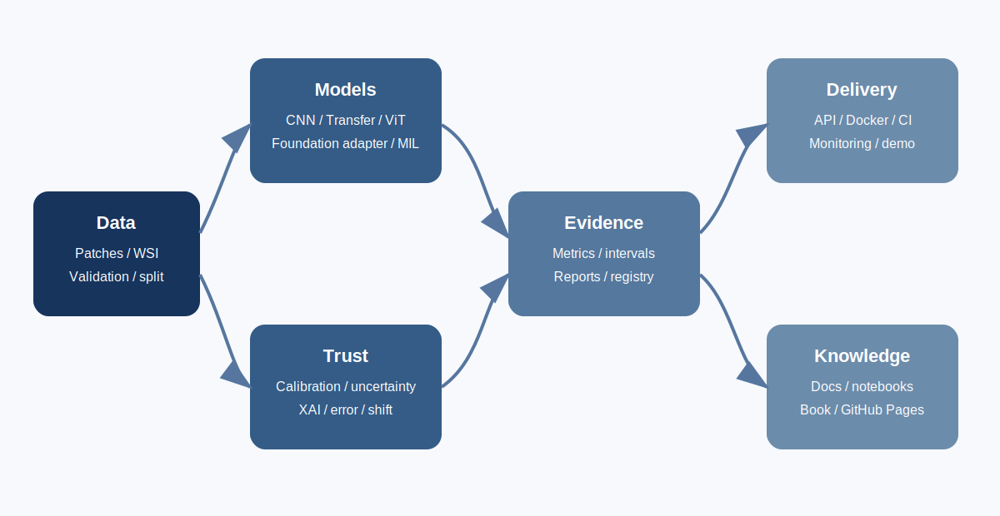

# Computational Pathology AI Lab

**From CNN Baselines to Foundation Models, Explainable AI, and Production MLOps**

[](https://github.com/FaramarzKowsari/computational-pathology-ai-lab/actions)
[](https://www.python.org/)
[](LICENSE)
[](https://doi.org/10.5281/zenodo.21444837)
[](book/README.md)
[](docs/ZENODO_SOFTWARE_GUIDE.md)

A production-oriented, research-first platform for computational pathology. It connects four professional capabilities in one auditable codebase:

1. **Medical AI Research** - rigorous experimental design, calibration, uncertainty, error analysis, domain shift, and external-validation readiness.
2. **ML Engineering and MLOps** - packaging, configuration, tests, CI, Docker, DVC, MLflow hooks, model registry structure, and monitoring.
3. **Computer Vision Engineering** - CNNs, transfer learning, Vision Transformers, foundation-model adapters, MIL, WSI utilities, and explainability.
4. **Academic Teaching and Technical Authorship** - notebooks, methodology, model/data cards, research questions, a technical report template, and a companion book.

> **Research and educational software only. Not a medical device. Not validated for clinical diagnosis or patient care.**



## Project origin: University of Colorado Boulder

The repository began as the author's **Deep Learning Cancer Detection** mini-project for a University of Colorado Boulder graduate course. The original notebooks, Kaggle submission, and leaderboard image are preserved through the migration workflow in `legacy/cu_boulder_original_assignment/`. This release expands that academic assignment into a maintainable computational-pathology engineering platform.

Run `python scripts/migrate_legacy.py` once after extracting this package over the existing local repository. It moves the exact original files from the repository root into the legacy archive without modifying their contents.

## Companion book

**Computational Pathology Engineering**  
*From Histology Patches and CNNs to Whole-Slide Foundation Models, Explainable AI, and Production MLOps*  
Author: **Faramarz Kowsari**  
Book DOI: **[10.5281/zenodo.21444837](https://doi.org/10.5281/zenodo.21444837)**  
Google Books key: **GGKEY:8ZWNQ7NFGBL**

A temporary **Sample Placeholder Edition** is included at [`book/computational-pathology-engineering.pdf`](book/computational-pathology-engineering.pdf). Replace that file with the final infographic book while keeping the same filename.

## What is executable now?

| Capability | Status |
|---|---|
| Synthetic patch generation and validation | Executable on CPU |
| Stratified/group-aware splitting | Executable |
| Baseline CNN and tiny Vision Transformer | Executable |
| Torchvision ResNet, DenseNet, EfficientNet, ConvNeXt | Executable when optional model dependencies are installed |
| Training and evaluation loops | Executable |
| Metrics, calibration, bootstrap intervals, error analysis | Executable |
| Grad-CAM, integrated gradients, occlusion, MC dropout | Executable |
| Tissue mask, patch extraction, MIL | Executable for supported image inputs |
| FastAPI service | Executable with a trained checkpoint or clearly labeled demo predictor |
| Streamlit interface | Executable after installing optional UI dependencies |
| DVC, MLflow, Docker, CI | Configured |
| Real Kaggle benchmark | **Not Yet Benchmarked in this release** |
| Pathology foundation-model weights | Adapter architecture only; weights are not redistributed |
| Clinical/external validation | **Not Performed** |

## Quick start

```bash
python -m venv .venv
# Windows: .venv\Scripts\activate
# macOS/Linux: source .venv/bin/activate
pip install -e ".[dev]"

cpathlab generate-synthetic --output data/example --samples 40
cpathlab validate-data --image-dir data/example/images --labels data/example/labels.csv
cpathlab train-synthetic --data-dir data/example --epochs 1 --output models/demo.pt
pytest -q
```

Run the API:

```bash
uvicorn cpathlab.api.main:app --host 0.0.0.0 --port 8000
```

Open `http://localhost:8000/docs` for interactive API documentation.

## Core commands

```bash
make setup
make synthetic
make test
make quality
make train-smoke
make api
```

## Architecture

```text
Histology patches / WSI
        |
        +--> validation --> stain/preprocessing --> split audit
        |
        +--> CNN / transfer model / ViT / foundation adapter
        |                          |
        |                          +--> attention MIL for slide-level learning
        |
        +--> training --> experiment tracking --> model registry
        |
        +--> metrics --> calibration --> uncertainty --> error analysis
        |
        +--> explainability --> API/demo --> monitoring and drift reports
```

## Repository map

- `src/cpathlab/` - reusable Python package.
- `configs/` - model and experiment YAML configurations.
- `scripts/` - operational entry points and legacy migration.
- `tests/` - unit and integration tests.
- `notebooks/` - teaching-oriented notebooks without fabricated outputs.
- `docs/` - architecture, methodology, ethics, reproducibility, and deployment guides.
- `book/` - book metadata, citations, and replaceable sample PDF.
- `website/` - SEO-ready GitHub Pages site with JSON-LD.
- `legacy/` - preserved Boulder assignment after migration.
- `reports/` - verified build/test reports and benchmark templates.

## Reproducibility principles

- Fix seeds and record environment information.
- Split by patient/slide before patch extraction.
- Never tune on the test set.
- Report confidence intervals and calibration, not only discrimination.
- Preserve failure cases and subgroup results.
- Distinguish executed evidence from planned experiments.

## Citation

See [`CITATION.cff`](CITATION.cff) and [`CITATION.bib`](CITATION.bib). The software DOI is intentionally left unassigned until the first public Zenodo release. The companion-book DOI is already reserved and used throughout the project.

## Author

**Faramarz Kowsari** - author, software engineer, and AI researcher based in Istanbul.  
[ORCID](https://orcid.org/0000-0003-1692-0453) | [GitHub](https://github.com/FaramarzKowsari) | [Google Scholar](https://scholar.google.com/citations?user=G7tP5WMAAAAJ) | [LinkedIn](https://www.linkedin.com/in/faramarzkowsari/)

## License

MIT for repository code. External datasets and pretrained weights retain their own terms.
